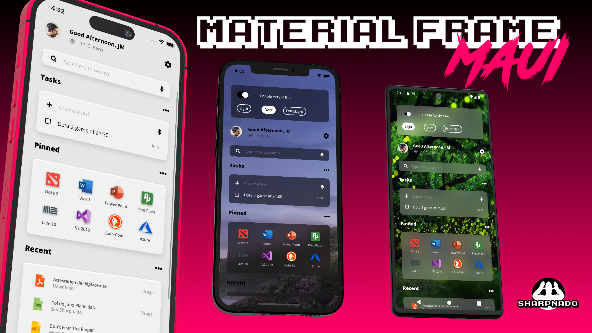
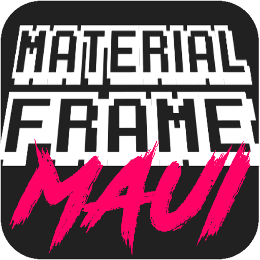

# Sharpnado.MaterialFrame



## Supported platforms

| | |
| - | - |
|  | [](https://www.nuget.org/packages/Sharpnado.MaterialFrame.Maui) <br/><br/> :heavy_check_mark: **Android** <br/> :heavy_check_mark: **iOS** <br/> :heavy_check_mark: **MacCatalyst** <br/> :heavy_check_mark: **WinUI** |


## Initialization

* In `MauiProgram.cs`:

```csharp
public static MauiApp CreateMauiApp()
{
    var builder = MauiApp.CreateBuilder();
    builder
        .UseMauiApp<App>()
        .UseSharpnadoMaterialFrame(loggerEnable: false)
        ...
}
```

## Version 3.0 - What's New

Version 3.0 brings a complete overhaul of the MaterialFrame architecture with major improvements:


https://github.com/user-attachments/assets/cd1bdeda-9c55-484a-938f-88ef2acbf26a


### Handler Migration

All platforms have been migrated from the old Renderer pattern to modern MAUI Handlers:
* **Android**: ContentViewHandler
* **iOS**: ContentViewHandler
* **MacCatalyst**: ContentViewHandler (full support added!)
* **Windows**: ViewHandler<MaterialFrame, Grid>

Benefits: Better performance, cleaner code, better maintainability, and future-proof architecture.

### Android Blur Revolution

**Breaking Change**: Replaced RenderScript with StackBlur algorithm

#### Why?
RenderScript was deprecated by Google and completely broken on Android 15+ devices with 16KB page size (crashes on Pixel 8 and newer devices).

#### The Solution: StackBlur
* **Pure C# implementation** - No native dependencies, works on ALL Android versions including 15+
* **Async background processing** - Blur runs on background thread with double buffering
* **Change detection** - Skips blur when content hasn't changed (0% CPU when static)
* **Smooth performance** - UI thread blocking reduced from ~22ms to ~3ms
* **60 FPS scrolling** - No more frame drops during animations

#### Performance Metrics
| Metric | Before (RenderScript) | After (StackBlur) |
|--------|----------------------|-------------------|
| Android 15+ compatibility | 💥 Broken | ✅ Works |
| UI thread time | ~22ms | ~3ms |
| Static content CPU | 100% | 0% |
| Frame rate | 30-45 FPS | 60 FPS |
| Blur quality | Excellent | Excellent |

### New Features

* **MacCatalyst Support**: Full blur support on Mac with shared iOS handler
* **Better Memory Management**: Improved resource cleanup across all platforms
* **PropertyMapper**: Declarative property handling for better performance

### Migration Guide

No breaking changes in the API! Your existing XAML and code will work as-is. The improvements are all under the hood.

The only change: Android now uses StackBlur instead of RenderScript, which means:
* ✅ Works on Android 15+
* ✅ No more crashes on 16KB page size devices
* ✅ Better performance overall

## Android Compatibility issues

Warning, because of `LayerDrawable` the `Acrylic` glow effect (the white glow on the top of the `MaterialFrame` is only available on API 23+ (since Marshmallow).

## Presentation

The MAUI `MaterialFrame` delivers out of the box modern popular theming:
  * Light
  * Dark
  * Acrylic
  * AcrylicBlur

You can switch from one theme to another thanks to the `MaterialTheme` property.


## MaterialTheme

### Light

In light theme, you can set the `LightThemeBackgroundColor` and control the `Elevation`.


### Dark

In dark theme, you can only control the `Elevation`, more elevation equals more light on the black frame (see below).


### Acrylic

In Acrylic theme, you can still set the `LightThemeBackgroundColor`, also a `Color` of `F1F1F1` is advised to have a good `Acrylic` effect.


### AcrylicBlur

In AcrylicBlur theme, `LightThemeBackgroundColor` and `Elevation` properties are discarded.

You can set the `BlurStyle` property for both `Android` and `iOS`.

**REMARK:** On `Android`, the blur uses a pure C# StackBlur implementation that's optimized with async processing and change detection. It's performant but still a CPU operation, so use it wisely.

#### Light


#### ExtraLight


#### Dark


#### WinUI specific properties

WinUI is the home of the `Acrylic` effect \o/

##### WinUIBlurOverlayColor

WinUI only.

Changes the overlay color over the blur (should be a transparent color, obviously).
If not set, the different blur style styles take over.

#### Android specific properties

Because the `Android` version is a custom blur implementation, you have access to some fine tuning properties.

##### AndroidBlurOverlayColor

Android only.

Changes the overlay color over the blur (should be a transparent color, obviously).
If not set, the different blur style styles take over.

##### AndroidBlurRadius

Android only.

Changes the blur radius on Android.
If set, it takes precedence over MaterialBlurStyle.
If not set, the different blur style styles take over.

##### AndroidBlurRootElement (Performance)

Android only: the root element must be an ancestor of the MaterialFrame.

Blur computation is very costly on Android since it needs to process all the view hierarchy from the
root element to be blurred (most of the time the element displaying the underlying image) to the blur frame.
The shorter the path, the better the performance. If no root element is set, the activity decor view is used.

#### Android handler configuration

You can configure the `Android` handler with the `BlurProcessingDelayMilliseconds` property on the `MaterialFrame` element.

Sometimes the computation of the background can take some time (svg images for example).
Setting a bigger delay ensures that the background is rendered first and can fix some glitches.

The Android implementation includes:
* **StackBlur**: Pure C# blur algorithm (no native dependencies)
* **Async processing**: Blur runs on background thread with double buffering
* **Change detection**: Skips blur when content hasn't changed (0% CPU when static)
* **Performance**: UI thread blocking reduced from ~22ms to ~3ms

### LightThemeBackgroundColor

The background color in `Light` and `Acrylic` themes. In `Dark` theme, this value is ignored because the background color depends on the `Elevation`.
In `AcrylicBlur`, the value is discarded cause `iOS` doesn't allow you to control the overlay color. 
Note that setting the `BackgroundColor` property has no effect with the `MaterialFrame`.

### AcrylicGlowColor

You can change the "glow" of a `MaterialFrame` with an acrylic theme (the thin top white glow).
Default is white.
This property is ignored is the theme is not set to Acrylic.

### Elevation

This property semantic changes according to the theme currently set:

#### Light Theme

Cast a shadow according to [Google's Material elevation specs](https://material.io/design/environment/elevation.html).

#### Dark Theme

Change the frame's background color according to [Google's dark mode specs](https://material.io/design/color/dark-theme.html#properties): 


#### Acrylic Theme 

Property is ignored and a custom shadow is applied.

#### AcrylicBlur Theme 

Property is ignored, no shadow is cast.

### CornerRadius

Sets the corner radius of the frame (default: 5).

## Changing theme for every frames

You either use `DynamicResource` as explained in my [previous post](https://www.sharpnado.com/dark-light-mode/).

Or use the static method called `ChangeGlobalTheme(Theme newTheme)`. Setting a new theme on this method will change the `MaterialTheme` of every `MaterialFrame` of your app.

### Examples of styles

#### Acrylic style

```xml
<ResourceDictionary xmlns="http://schemas.microsoft.com/dotnet/2021/maui"
                    xmlns:x="http://schemas.microsoft.com/winfx/2009/xaml"
                    xmlns:sh="clr-namespace:Sharpnado.MaterialFrame;assembly=Sharpnado.MaterialFrame">

    <ResourceDictionary.MergedDictionaries>
        <ResourceDictionary Source="Colors.xaml" />
    </ResourceDictionaries.MergedDictionaries>

    <Style TargetType="sh:MaterialFrame">
        <Setter Property="MaterialTheme" Value="Acrylic" />
        <Setter Property="Margin" Value="5, 5, 5, 10" />
        <Setter Property="Padding" Value="20,15" />
        <Setter Property="CornerRadius" Value="10" />
        <Setter Property="LightThemeBackgroundColor" Value="{StaticResource AcrylicFrameBackgroundColor}" />
    </Style>

</ResourceDictionary>
```

`Colors.xaml` file:

```xml
<?xml version="1.0" encoding="UTF-8" ?>

<ResourceDictionary xmlns="http://schemas.microsoft.com/dotnet/2021/maui" 
                    xmlns:x="http://schemas.microsoft.com/winfx/2009/xaml">

    <Color x:Key="AcrylicSurface">#E6E6E6</Color>

    <Color x:Key="AcrylicFrameBackgroundColor">#F1F1F1</Color>

    <Color x:Key="AccentColor">#00E000</Color>

    <Color x:Key="PrimaryColor">Black</Color>
    <Color x:Key="SecondaryColor">#60000000</Color>
    <Color x:Key="TernaryColor">#30000000</Color>

    <Color x:Key="TextPrimaryColor">Black</Color>
    <Color x:Key="TextSecondaryColor">#60000000</Color>
    <Color x:Key="TextTernaryColor">#40000000</Color>

</ResourceDictionary>
```


### Dynamic styles

MaterialFrame xaml:

```xml
    <sh:MaterialFrame
        Margin="0,16"
        Padding="16,10"
        Elevation="4"
        LightThemeBackgroundColor="{DynamicResource DynamicLightThemeColor}"
        CornerRadius="{DynamicResource DynamicCornerRadius}"
        MaterialTheme="{DynamicResource DynamicMaterialTheme}" />
```

Styles:

```xml
    <Color x:Key="DarkSurface">#121212</Color>
    <Color x:Key="LightSurface">#02FF0266</Color>
    <Color x:Key="AcrylicSurface">#E4E4E4</Color>

    <Color x:Key="OnSurfaceColor">#FFFFFF</Color>
    <Color x:Key="AcrylicFrameBackgroundColor">#F1F1F1</Color>
```

Theme switching code:

```csharp
    public static void SetDarkMode()
    {
        // MaterialFrame.ChangeGlobalTheme(MaterialFrame.Theme.Dark);
        SetDynamicResource(DynamicMaterialTheme, MaterialFrame.Theme.Dark);

        SetDynamicResource(DynamicBackgroundColor, "DarkSurface");
        SetDynamicResource(DynamicCornerRadius, 5);
    }

    public static void SetLightMode(bool isAcrylic)
    {
        // MaterialFrame.ChangeGlobalTheme(isAcrylic ? MaterialFrame.Theme.Acrylic : MaterialFrame.Theme.Light);
        SetDynamicResource(DynamicMaterialTheme, isAcrylic ? MaterialFrame.Theme.Acrylic : MaterialFrame.Theme.Light);

        SetDynamicResource(DynamicBackgroundColor, isAcrylic ? "AcrylicSurface" : "LightSurface");
        SetDynamicResource(DynamicLightThemeColor, isAcrylic ? "AcrylicFrameBackgroundColor" : "OnSurfaceColor");
        SetDynamicResource(DynamicCornerRadius, isAcrylic ? 10 : 5);
    }
```

## Performance

### Android Blur Performance

The Android blur implementation has been completely rewritten for v3.0:

* **StackBlur algorithm**: Pure C# implementation, no RenderScript dependency
* **Async processing**: Runs on background thread with double buffering
* **Change detection**: Only processes blur when content changes
* **Results**: UI thread blocking reduced from ~22ms to ~3ms, smooth 60 FPS scrolling

### Acrylic Mode

The Acrylic glow effect uses a single view with lightweight rendering:
* `LayerDrawable` on Android
* `CALayer` on iOS/MacCatalyst

Only the background changes, no view stacking required.

## License

### Android Blur Implementation

The StackBlur algorithm is based on Mario Klingemann's implementation.

Copyright Mario Klingemann (http://incubator.quasimondo.com)

Licensed under the MIT License.

### Legacy Code Attribution

Previous versions used RealtimeBlurView by Tu Yimin (http://github.com/mmin18).
Licensed under the Apache License, Version 2.0.
