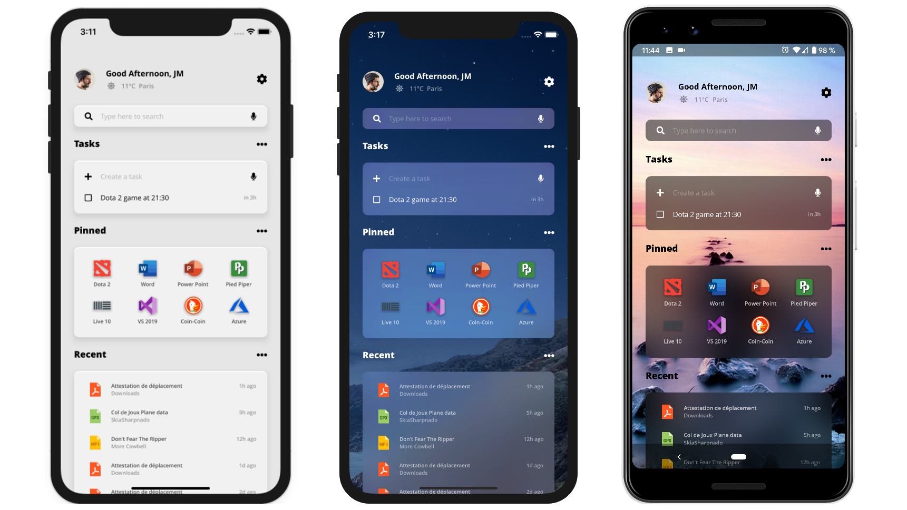
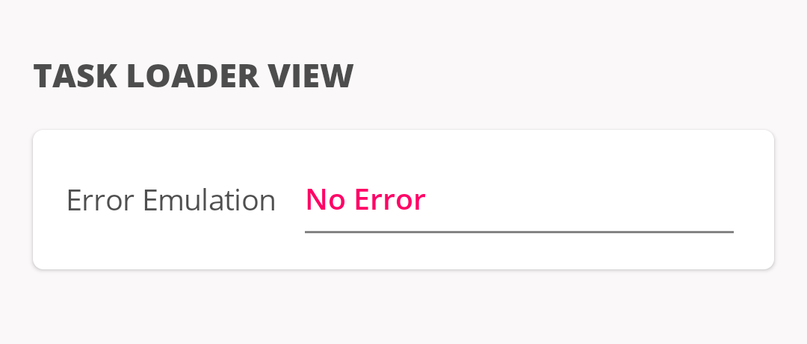
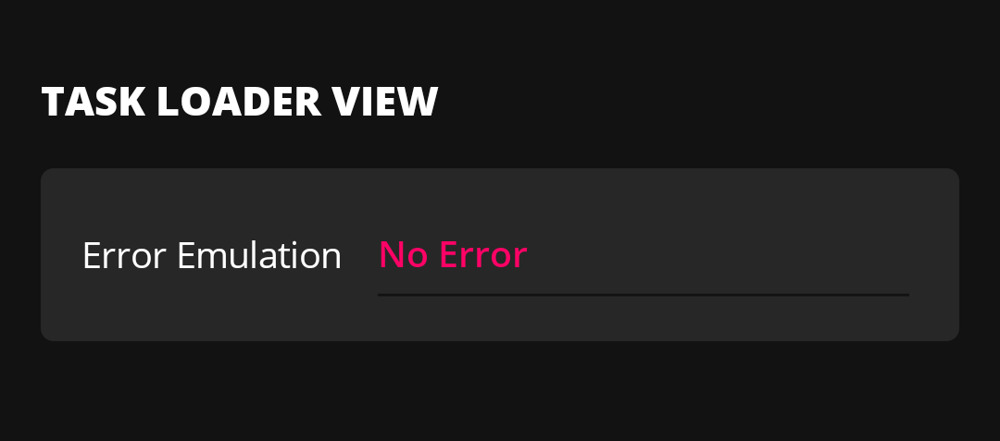
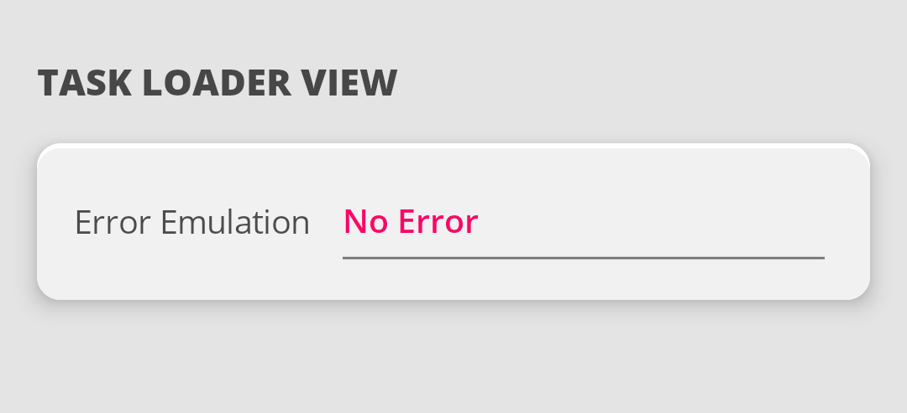
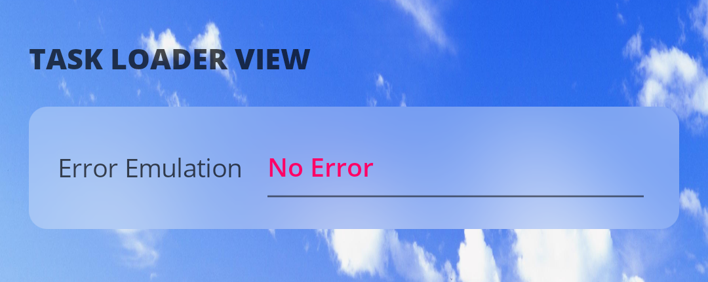
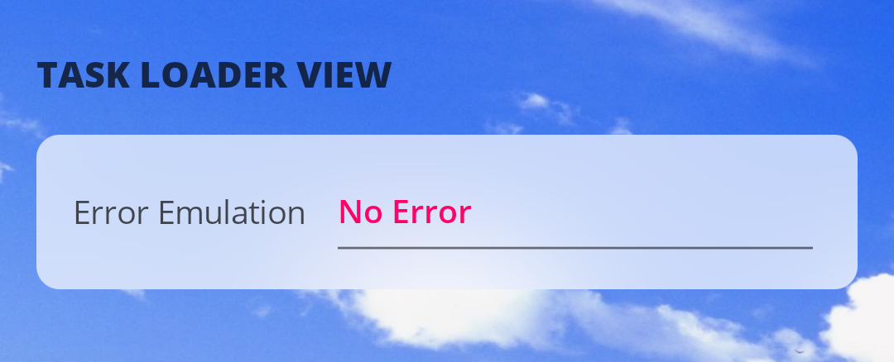
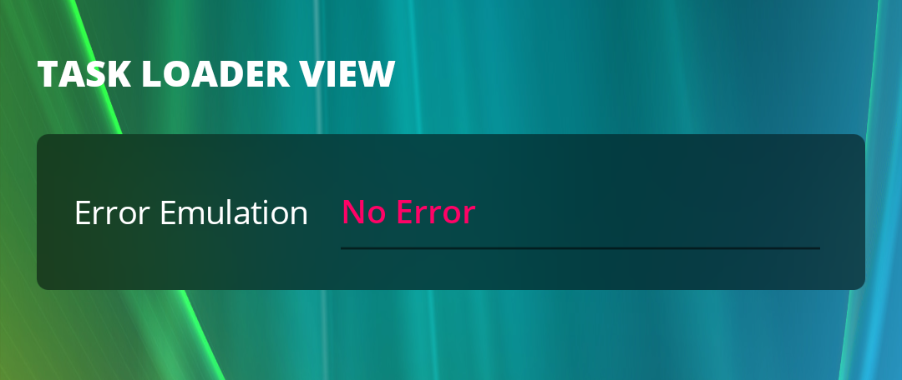
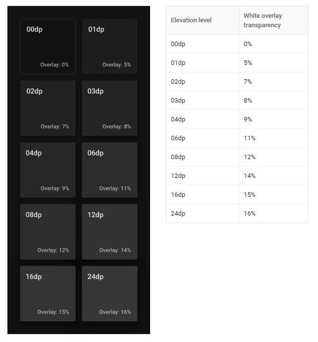

# Sharpnado.MaterialFrame

<p align="left">

Get it from NuGet:

[](https://www.nuget.org/packages/Sharpnado.MaterialFrame)



## Initialization

On `iOS` add this line after `Xamarin.Forms.Forms.Init()` and before `LoadApplication(new App())`.

`iOSMaterialFrameRenderer.Init();`

## Presentation

The Xamarin.Forms `MaterialFrame` aims at delivering out of the box modern popular theming such as:
  * Light
  * Dark
  * Acrylic
  * AcrylicBlur

You can switch from one theme to another thanks to the `MaterialFrame` property.


## Sample Apps

The `MaterialFrame` is extensively used in the [Sharpnado.Acrylic](https://github.com/roubachof/Sharpnado.Acrylic) and the [Xamarin-Forms-Practices](https://github.com/roubachof/Xamarin-Forms-Practices) sample apps.

## MaterialTheme

### Light

In light theme, you can set the `LightThemeBackgroundColor` and control the `Elevation`.



### Dark

In dark theme, you can only control the `Elevation`, more elevation equals more light on the black frame (see below).



### Acrylic

In Acrylic theme, you can still set the `LightThemeBackgroundColor`, also a `Color` of `F1F1F1` is advised to have a good `Acrylic` effect.



### AcrylicBlur

In AcrylicBlur theme, `LightThemeBackgroundColor` and `Elevation` properties are discarded.

You can set the `BlurStyle` property for both `Android` and `iOS`.

**REMARK:** On `Android` go easy on the blur: it's a resource intensive operation. For each blurred frame, it will go trough all the view hierarchy from the root view to the target view.

#### Light



#### ExtraLight



#### Dark




#### Android specific properties

Because the `Android` version is a custom blur implementation, you have access to some fine tuning properties.

##### AndroidBlurOverlayColor

Android only.

Changes the overlay color over the blur (should be a transparent color, obviously).
If not set, the different blur style styles take over.

##### AndroidBlurRadius

Android only.

Changes the blur radius on Android.
If set, it takes precedence over MaterialBlurStyle.
If not set, the different blur style styles take over.

##### AndroidBlurRootElement (Performance)

Android only: the root element must be an ancestor of the MaterialFrame.

Blur computation is very costly on Android since it needs to process all the view hierarchy from the
root element to be blurred (most of the time the element displaying the underlying image) to the blur frame.
The shorter the path, the better the performance. If no root element is set, the activity decor view is used.

#### Android renderer configuration

You can configure 2 different static properties on the `Android` renderer:

##### AndroidMaterialFrameRenderer.BlurProcessDelayMilliseconds

When a page visibility changes we activate or deactivate blur updates.
Setting a bigger delay could improve performance and rendering.

##### AndroidMaterialFrameRenderer.ThrowStopExceptionOnDraw

If set to `true`, the rendering result could be better (clearer blur not mixing front elements).
However due to a bug in the `Xamarin` framework https://github.com/xamarin/xamarin-android/issues/4548, debugging is impossible with this mode (causes SIGSEGV).
My suggestion would be to set it to false for debug, and to true for releases.

### LightThemeBackgroundColor

The background color in `Light` and `Acrylic` themes. In `Dark` theme, this value is ignored because the background color depends on the `Elevation`.
In `AcrylicBlur`, the value is discarded cause `iOS` doesn't allow you to control the overlay color. 
Note that setting the `BackgroundColor` property has no effect with the `MaterialFrame`.

### Elevation

This property semantic changes according to the theme currently set:

#### Light Theme

Cast a shadow according to [Google's Material elevation specs](https://material.io/design/environment/elevation.html).

#### Dark Theme

Change the frame's background color according to [Google's dark mode specs](https://material.io/design/color/dark-theme.html#properties): 



#### Acrylic Theme 

Property is ignored and a custom shadow is applied.

#### AcrylicBlur Theme 

Property is ignored, no shadow is cast.

### CornerRadius

Same as the `Xamarin.Forms` `Frame` here.


## Changing theme for every frames

You either use `DynamicResource` as explained in my [previous post](https://www.sharpnado.com/dark-light-mode/).

Or use the static method called `ChangeGlobalTheme(Theme newTheme)`. Setting a new theme on this method will change the `MaterialTheme` of every `MaterialFrame` of your app.

### Examples of styles

#### Acrylic style

From `Sharpnado.Acrylic` github repo, `MaterialFrame.xaml` file:

```xml
<ResourceDictionary xmlns="http://xamarin.com/schemas/2014/forms"
                    xmlns:x="http://schemas.microsoft.com/winfx/2009/xaml"
                    xmlns:rv="clr-namespace:Sharpnado.Presentation.Forms.RenderedViews;assembly=Sharpnado.Presentation.Forms">

    <ResourceDictionary.MergedDictionaries>
        <ResourceDictionary Source="Colors.xaml" />
    </ResourceDictionary.MergedDictionaries>

    <Style TargetType="rv:MaterialFrame">
        <Setter Property="MaterialTheme" Value="Acrylic" />
        <Setter Property="Margin" Value="5, 5, 5, 10" />
        <Setter Property="Padding" Value="20,15" />
        <Setter Property="CornerRadius" Value="10" />
        <Setter Property="LightThemeBackgroundColor" Value="{StaticResource AcrylicFrameBackgroundColor}" />
    </Style>

</ResourceDictionary>
```

`Color.xaml` file:

```xml
<?xml version="1.0" encoding="UTF-8" ?>
<?xaml-comp compile="true" ?>

<ResourceDictionary xmlns="http://xamarin.com/schemas/2014/forms" xmlns:x="http://schemas.microsoft.com/winfx/2009/xaml">

    <Color x:Key="AcrylicSurface">#E6E6E6</Color>

    <Color x:Key="AcrylicFrameBackgroundColor">#F1F1F1</Color>

    <Color x:Key="AccentColor">#00E000</Color>

    <Color x:Key="PrimaryColor">Black</Color>
    <Color x:Key="SecondaryColor">#60000000</Color>
    <Color x:Key="TernaryColor">#30000000</Color>

    <Color x:Key="TextPrimaryColor">Black</Color>
    <Color x:Key="TextSecondaryColor">#60000000</Color>
    <Color x:Key="TextTernaryColor">#40000000</Color>

</ResourceDictionary>
```


### Dynamic styles

From the [Silly App! github repository](https://github.com/roubachof/Xamarin-Forms-Practices).

MaterialFrame xaml:

```xml
    <renderedViews:MaterialFrame
        Margin="0,16"
        Padding="16,10"
        Elevation="4"
        LightThemeBackgroundColor="{DynamicResource DynamicLightThemeColor}"
        CornerRadius="{DynamicResource DynamicCornerRadius}"
        MaterialTheme="{DynamicResource DynamicMaterialTheme}" />
```

Styles:

```xml
    <Color x:Key="DarkSurface">#121212</Color>
    <Color x:Key="LightSurface">#02FF0266</Color>
    <Color x:Key="AcrylicSurface">#E4E4E4</Color>

    <Color x:Key="OnSurfaceColor">#FFFFFF</Color>
    <Color x:Key="AcrylicFrameBackgroundColor">#F1F1F1</Color>
```

Theme switching code:

```csharp
    public static void SetDarkMode()
    {
        // MaterialFrame.ChangeGlobalTheme(MaterialFrame.Theme.Dark);
        SetDynamicResource(DynamicMaterialTheme, MaterialFrame.Theme.Dark);

        SetDynamicResource(DynamicBackgroundColor, "DarkSurface");
        SetDynamicResource(DynamicCornerRadius, 5);
    }

    public static void SetLightMode(bool isAcrylic)
    {
        // MaterialFrame.ChangeGlobalTheme(isAcrylic ? MaterialFrame.Theme.Acrylic : MaterialFrame.Theme.Light);
        SetDynamicResource(DynamicMaterialTheme, isAcrylic ? MaterialFrame.Theme.Acrylic : MaterialFrame.Theme.Light);

        SetDynamicResource(DynamicBackgroundColor, isAcrylic ? "AcrylicSurface" : "LightSurface");
        SetDynamicResource(DynamicLightThemeColor, isAcrylic ? "AcrylicFrameBackgroundColor" : "OnSurfaceColor");
        SetDynamicResource(DynamicCornerRadius, isAcrylic ? 10 : 5);
    }
```

### Know Issues

#### iOS

For some yet to be discovered reasons, `AcrylicBlur` value doesn't work in a dynamic context on `iOS`.

You can change the `BlurStyle` dynamically, but a dynamic change from a not blurry theme to the `AcrylicBlur` theme will result in a transparent frame.

#### Android

Sometimes the Android emulator can stall due to too many `AcrylicBlur` frames displaying at the same time.

## Performance

To achieve the nice white glow effect, the first idea was to use two `Xamarin.Forms` `Frame` stacked. The first one white, and the second one on top painted with the `LightThemeBackgroundColor`.
This was quite hacky and not really stable (for example assigning `BindableProperty` inside of the object embedding those properties break the property changed events in the renderers).

I then plan to use 2 `Frame` on `Android` and 2 `UIViews` on `iOS` on the respective renderers. 
But I didn't like the idea of stacking 2 views, that didn't seem a good tradeoff since now I was moving to the renderers world...

I finally find a way to have a unique view in each of the renderer:

1. `LayerDrawable` on Android
2. `CALayer` on iOS

Doing that only one view is used and only the background changes thanks to these lightweight objects.

## License

The blurring implementation on `Android` is a c# port of the popular [RealtimeBlurView](https://github.com/mmin18/RealtimeBlurView).

Copyright 2016 Tu Yimin (http://github.com/mmin18)

Licensed under the Apache License, Version 2.0 (http://www.apache.org/licenses/LICENSE-2.0);